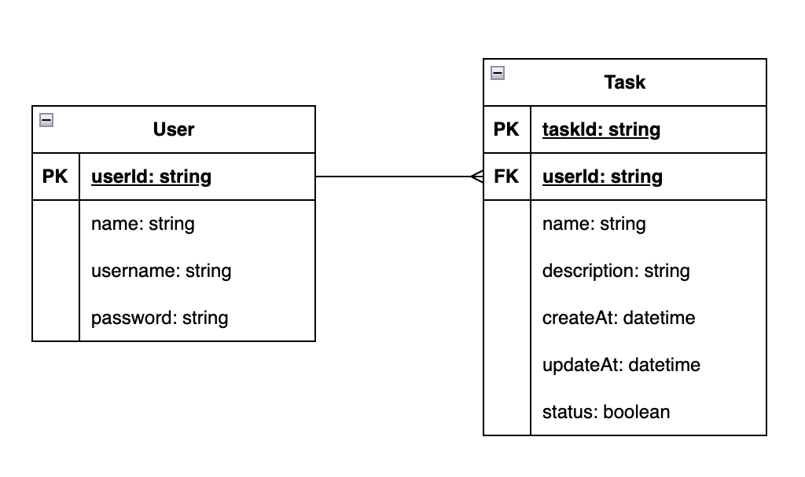

# Desafío Agilesoft

A continuación se presenta la solución (diseño e implementación) del desafío Agilesoft correspondiente al desarrollo de una API Rest en Java Springboot. El enunciado del desafío se encuentra el siguiente [LINK](/docs/Prueba-desarrollo-backend.pdf)

# Diseño

Se trata de dar solución al problema con un enfoque de "design-first". El problema comprende el registro de los usuairos, el inicio de sesión y un CRUD de tareas. Para el diseño de la solución se comienza definiendo las entidades del negocio (dominio), encontrándose: Usuario y Tarea:


Según el enunciado, se pueden establecer algunos atributos iniciales y las relaciones que pueden tener las entidad de negocio. A continuación, se presenta el esquema inicial de entidad-relación con dichos atributos y que será implementado posteriormente:



La aplicación se diseñará considerando una arquitectura limpia (hexagonal), aplicando los principios SOLID y, si es necesario, aplicar patrones de diseño.

## Casos de uso

Según el enunciado se tienen 7 casos de uso a implementar para su funcionamiento:

1. Inscribir un usuarios
2. Login
3. Obtener datos usuario a partir de sesión
4. Obtener listado de tareas del usuario y su estado
5. Agregar tarea asociada al usuario
6. Marcar como resuelta una tarea de un usuario
7. Eliminar una tarea de un usuario

Si bien se implementarán todos los casos de uso, solo se diseñará y documentará como ejemplo el caso de uso: *Agregar tarea asociada al usuario*; para la implementación de los otros casos de usos se seguirá el mismo patrón

## Diagrama de secuencia

A continuación, se presenta el diagrama de secuencia del caso de uso *Agregar tarea asociada al usuario*. En el diagrama se puede apreciar (de forma simplificada) las interacciones entre las capas de la arquitectura limpia, así como las reglas de aplicación y negocio:


# Implementación

## Estructura de carpetas

Para la estructura de carpeta se utiliza arquitectura hexagonal + vertical slicing, quedando de la siguiente manera (ejemplo):

```
- src /
    users /
      application /
      domain /
      infrastructure/
    tasks /
      application /
      domain /
      infrastruture /
...
```

## Librerías

Para la creación del proyecto se utilizará principalmente:

```
Spring Data JPA SQL
Persist data in SQL stores with Java Persistence API using Spring Data and Hibernate.

H2 Database SQL
Provides a fast in-memory database that supports JDBC API and R2DBC access, with a small (2mb) footprint. Supports embedded and server modes as well as a browser based console application.

Lombok DEVELOPER TOOLS
Java annotation library which helps to reduce boilerplate code.

Spring Boot DevTools DEVELOPER TOOLS
Provides fast application restarts, LiveReload, and configurations for enhanced development experience.

Docker Compose Support DEVELOPER TOOLS
Provides docker compose support for enhanced development experience.

Spring Web WEB
Build web, including RESTful, applications using Spring MVC. Uses Apache Tomcat as the default embedded container.

Spring HATEOAS WEB
Eases the creation of RESTful APIs that follow the HATEOAS principle when working with Spring / Spring MVC.

Spring Security SECURITY
Highly customizable authentication and access-control framework for Spring applications.

Spring Session WEB
Provides an API and implementations for managing user session information.
```

## Docker

Para el proyecto se utilizará el contenedor Docker para su simplicidad de uso. Este contenedor contine la aplicación y puede ser obtenido con la siguiente sentencia:

```
docker pull faqcodes/challenge-agilesoft
```

Para la construcción y ejecución se utilizan las siguientes sentencias:

```
docker build -t challenge-agilesoft .
docker run -p 3000:3000 challenge-agilesoft
```

## Uso de la Aplicación
